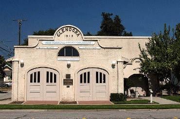
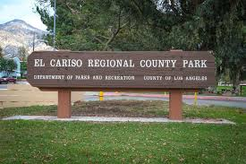
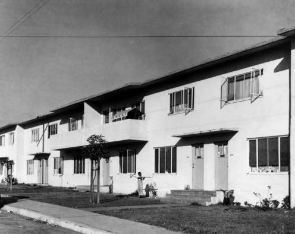
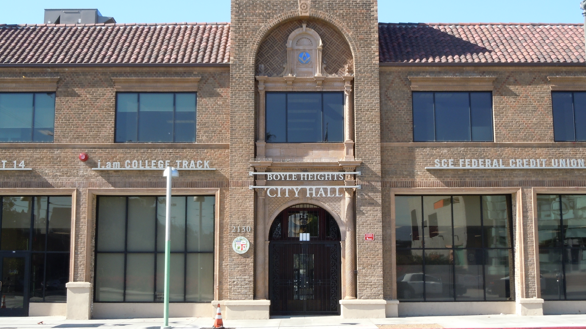

   {:.image}
[Glendora Historical Society](https://uclachicanxstudies.github.io/BarrioSuburbanisms/#/article/2021-02-20-alissapulmanopin1) 
   {:.caption} 

   {:.image}
[El Cariso Community Regional Park](https://uclachicanxstudies.github.io/BarrioSuburbanisms/#/article/2021-02-20-AndreaHidalgoPin1) 
   {:.caption}

   {:.image}
[Rancho San Pedro Housing Project](https://uclachicanxstudies.github.io/BarrioSuburbanisms/#/article/2021-02-20-AshleyMichelPin1) 
   {:.caption}

   {:.image}
[Boyle Heights City Hall](https://uclachicanxstudies.github.io/BarrioSuburbanisms/#/article/2021-02-20-AthriziZaragozaPin1) 
   {:.caption}
   

[Return to Home](https://uclachicanxstudies.github.io/BarrioSuburbanisms/)
