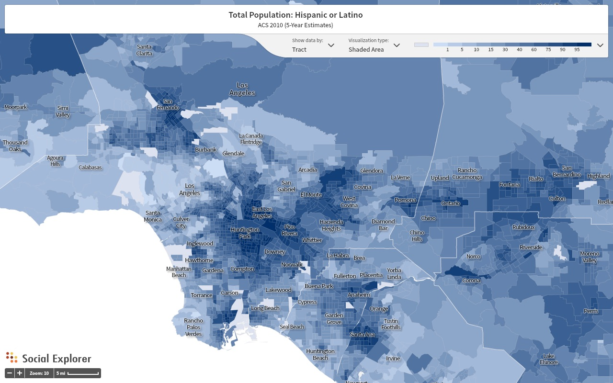

#### About
> In this interactive, multimedia map, you are invited to explore Los Angeles’ suburbia beyond the white picket-fence. Too often, suburbs are understood as fixed in time and defined by homeownership, whiteness, and middle-class status. By pairing photographs with student ethnographies, the Barrio Suburbanism Map complicates popular perceptions of the suburbs as sites of homogeneity in order to reveal the dynamic diversity of suburbanization in multiracial Los Angeles, with a focus on Latinx communities.

>Explore with us. Select individual pins to explore the rich histories of individual sites. Or, explore “pins” by color and take a tour of themes like immigration, social identity, activism, or architecture. In future months, you may also submit your own contribution for inclusion. 

>The Barrio Suburbanism map is a project created by faculty and students at UCLA in the Department of Chicana/o and Central American Studies in collaboration with librarians, archivists, and community advisors with the aim of moving us beyond the iconic scene of Los Angeles produced from the studios of the Hollywood Hills to the lived experiences of space radiating out from Mariachi Plaza in Boyle Heights to the Tierra Mia coffee shop in Huntington Park. Explore the “menu” to learn more about this project and how you can contribute to sharing the ever-unfolding history of this region.

{:.image}
"Hispanic Demographic 2010," courtesy of [Social Explorer](https://www.socialexplorer.com/10baeb3340/view)
{:.caption}

#### Navigation 
 Use dropdown menu at top right corner of map when navigating between pages outside of 'Home'

> [Browse Articles](https://uclachicanxstudies.github.io/BarrioSuburbanisms/#/article-index/)

> [Indigenous Lands](https://uclachicanxstudies.github.io/BarrioSuburbanisms/#/indigenouslands/)

> [Resources](https://uclachicanxstudies.github.io/BarrioSuburbanisms/#/resources/)

> [Contributors](https://uclachicanxstudies.github.io/BarrioSuburbanisms/#/contributors/)
