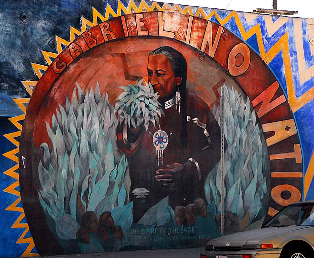

{:.image}
Gabrielino Nation: Spirit of the Sage, 1995, by Johanna Poething, Commissioned by Social and Public Art Resource Center [SPARC](http://www.justabovesunset.com/200910/html/everyone_welcome.html)
{:.caption}

> We would like to acknowledge that the lands that we live and work on, as well as those we seek to understand and represent, are those which were cultivated and occupied by indigenous Nations for thousands of years. The 1.2 million acres of land promised to the Gabrielino-Tongva tribe and other Mission Indians as compensation for relocation and expropriation were never officially allocated to the rightful owners of this land. We thank the Gabrielino-Tongva and associated Indigenous Nations for providing us with resources to better understand and learn from Indigenous ways of life and contributions to the historical development of the Los Angeles Basin and surrounding regions. As representatives of a land grant institution, we pay our respects to the Honuukvetam (Ancestors), ‘Ahiihirom (Elders) and ‘Eyoohiinkem (our relatives/relations) past, present and emerging.

> For more information, see [Gabrielino Tribe History](https://gabrielinotribe.org/history/), [Tongva Peoples History](https://www.tongvapeople.org/), [Gabrielino Tongva Tribe Official Site](http://gabrielino-tongva.com/)

> For a Story Map which integrates histories and narratives of Indigenous peoples with spatial geography, see [Mapping Indigenous LA: Placemaking Through Digitial Storytelling](https://www.arcgis.com/apps/MapJournal/index.html?appid=a9e370db955a45ba99c52fb31f31f1fc#)

{:.image}
[Tongva Sites of Yaanga, Map by David Deis (LAtitudes: an Angeleno's Atlas, Heyday Press, 2015)](https://decolonialatlas.wordpress.com/2017/07/26/tongva-sites-of-los-angeles/)
{:.caption}

[Return to Home](https://uclachicanxstudies.github.io/BarrioSuburbanisms/)
